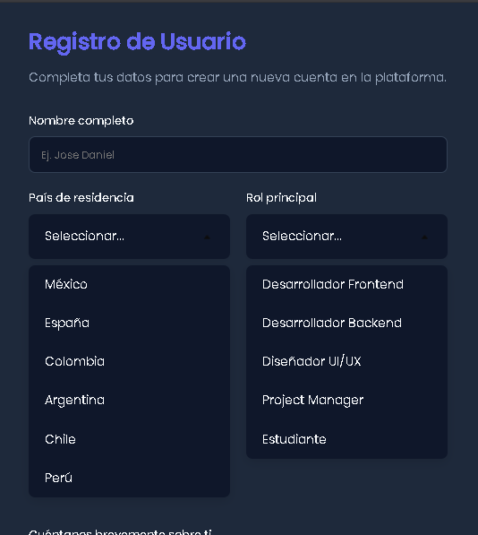
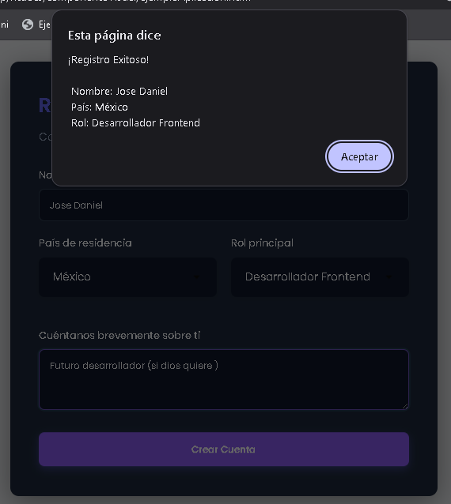

# Componente Visual: Menú Desplegable Personalizado 

* **Institución:** Instituto Tecnológico de Oaxaca
* **Carrera:** Ingeniería en Sistemas Computacionales
* **Materia:** Programación Web
* **Estudiante:** Rodriguez Juarez Jose Daniel
* **Grupo:** 7SC
* **GitHub Pages:**

---
## ¿Qué problema resuelve?
Los elementos `<select>` de HTML son difíciles de personalizar, su estilo es muy limitado y a menudo no se adaptan a diseños web modernos o interfaces de usuario avanzadas. 

Este componente visual resuelve ese problema proporcionando un menú desplegable interactivo, moderno y completamente personalizable. Reemplaza el comportamiento del `<select>` tradicional utilizando únicamente HTML, CSS y JavaScript puro, permitiendo al usuario una experiencia mas fluida y un control total sobre su apariencia.

---

## Instalación
Para utilizar este componente en tu propio proyecto, solo necesitas incluir los archivos de estilos (CSS) y las funciones (JS).

1. Asegúrate de tener los archivos `visuales.css` y `funciones.js` (junto con la imagen de la flecha `img/flecha_abajo.png`) dentro de la estructura de tu proyecto.
2. Enlaza los archivos en la sección `<head>` de tu documento HTML:

```html
<!-- Enlace a los estilos base del componente -->
<link rel="stylesheet" href="css/visuales.css">

<!-- Enlace al script que contiene la lógica del componente -->
<script src="js/funciones.js"></script>
```

---

## Ejemplo de Uso 
Implementar el componente es muy rápido. Utiliza la función `crearMenu()` desde JavaScript y apúntala a un contenedor vacío en tu HTML.

### 1. Prepara el HTML
Crea un `<div>` vacío con un `id` único donde deseas que aparezca el menú:

```html
<!-- Ejemplo de uso en un formulario-->
<div class="grupo-formulario">
    <label>País de residencia</label>
    <!-- Contenedor vacío donde se renderizará el menú -->
    <div id="menu-pais"></div>
</div>
```

### 2. Inicializa el Menú con JavaScript
En tu archivo de scripts, llama a la función `crearMenu()` y agrega el ID del contenedor, el texto por defecto, las opciones y colores personalizados.

```javascript
/*MENU DE EJEMPLO DE APLICACION*/
/* Inicializar el menú de países */
crearMenu(
    "menu-pais",         // ID del contenedor en el HTML
    "Seleccionar...",    // Título o placeholder por defecto
    [                    // Arreglo de opciones a mostrar
        "México",
        "España",
        "Colombia",
        "Argentina",
        "Chile",
        "Perú"
    ], 
    "#0f172a",           // (Opcional) Color de fondo 
    "#f8fafc"            // (Opcional) Color del texto 
);
```

### 3. Obtener el Valor Seleccionado
Para recolectar el dato que el usuario eligió, utiliza la función `obtenerValorMenu()`:

```javascript
document.getElementById('btn-enviar').addEventListener('click', () => {
    // Obtenemos el valor seleccionado pasando el ID del contenedor
    const paisSeleccionado = obtenerValorMenu("menu-pais");
    
    if (!paisSeleccionado) {
        alert("Por favor, selecciona un país.");
        return;
    }
    
    console.log("El usuario ha seleccionado:", paisSeleccionado);
});
```

---

## Capturas de Pantalla

* **Formulario con los menús en estado inicial:**
  

* **Menú abierto desplegando opciones:**
  

* **Alerta mostrando los datos recolectados exitosamente:**
  

---

## Video Demo Promocional 


